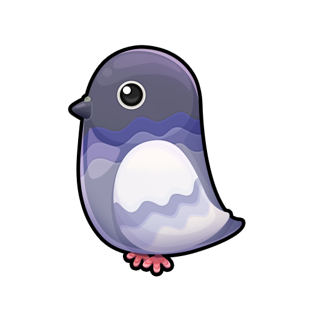
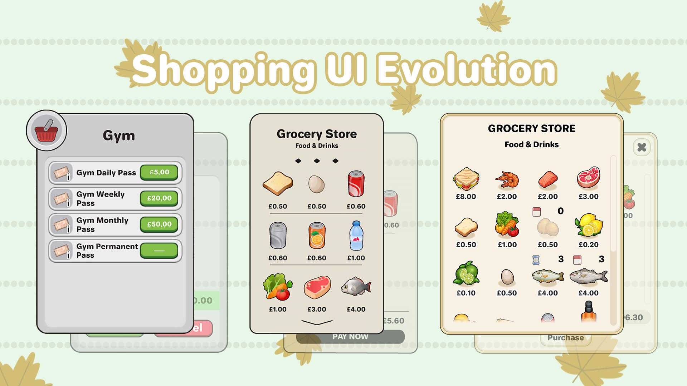
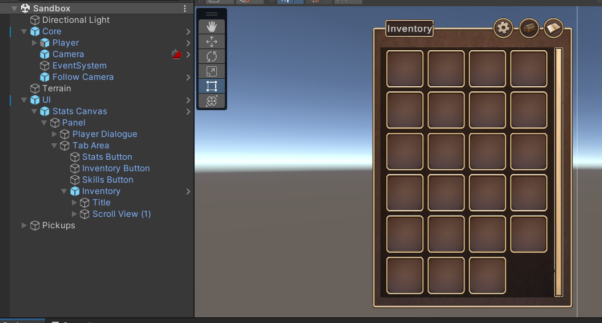

  <h1>LSW Clothes Shop</h1>

 
  

**Table of content**
- [Game Summary](#game-summary)
- [Characteristics](#characteristics)
- [Tarefas](#tarefas)

## Assets

- https://opengameart.org/
- https://craftpix.net/
- /////////////////////////////////////////////////////
- https://assetstore.unity.com/packages/2d/environments/pixel-art-top-down-basic-187605
- https://assetstore.unity.com/packages/2d/characters/fantasy-medieval-character-pack-81647
- https://opengameart.org/content/lpc-sara
- https://opengameart.org/content/exclamation-quest-icon

# Game Summary

- Create a functional clothes shop with all of the features you imagine would be required. It should be a top-down view like Stardew Valley.

- There should be a player character that is able to walk and interact with the game world.
- Features required: Talking to the shopkeeper, buying/selling items, item icons, item prices as well as equipping the bought outfits. The outfits that are equipped should be visible on the character itself.
- You may choose your own UI that you believe is suitable for this prototype.
- You can use pre-made art assets or create your own for this task.

https://bluegravity.wiki/interview/programming

# Characteristics

**The Game**
- The game is done within a house.
- The game has a shop keeper within the house, you can interact with him, when you get close to him an expression mark show on top of him meaning that you can interact with him.

**The Player**
- The player moves around with the letters WASD, he interacts using space, he selects things within the menu using mouse, he exits menus using escape or pressing the X icon.
- There is a label indicating the amount of money the player has.
- Items Equiped should be visible to the player!

**The Shop**
- The selling menu has two tabs, one for buys one for selling, when an item is selected a button to buy/sell appears.
- When you buy an item an options shows up asking you if you want to equip the item.
- When you enter the selling tab, it show which items you have equiped and which items are in your inventory, when you sell an items that is equiped you automatically unequipe it.
- There are 3 kind of items, shirts, pants and shoes.

# Tarefas

- ~~Create the house.~~
- ~~Insert the shopper~~
  - ~~Create iddle animation~~
  - ~~Create exclamation mark on top of him~~
- ~~Create the player~~
  - ~~Make sure the player can have interchangeable cloths equiped (Shirts, pants and boots)~~
  - Create idle animation
  - Move the player around using keys
  - Create moving animation
  - Create interaction with the shopper, the key should be serializable and you can select the keys (default space and scape to exit)
- Create the shopping menu
  - Create all the images of the shopping menu, remember that it has two tabs, one for buy one for sell.
  - Open the shopping menu after interaction of the player and the shopper
  - By default it ones in the buy tab, you can select an item, each item should be an scriptable object there. It has the icon, the name and the price. A hidden icon should show when the items is owned buy the player. A hidden icon should show when the item is equiped by the player.
  - Categorize each item between Shits, Pants and Boots
  - Make the player able to select an item and to select a tab using the mouse.
  - Also the player should close the shop using escape or pressing the X icon.
  - Buy:
    - Once an item is selected you can select if you want to buy it.
    - (Maybe a pop up with are you sure you want to buy the item)
    - Once the item is bought another menu show up asking if you want to equip it.
    - Also once you own an item, an icon within the item shows up.
    - If you equip an item, another icon withint the item shows up.
    - Once you buy an item, it gets a gray color and you can no longer buy the same item
  - Sell:
    - Same idea as buy, it should show the selling price of you owned items (50% of buying price)
    - Once the item is sold, it dissapears from the menu, and it returns to the buy tab
    - You can also equipe items from the sold tab, once you select an item with your mouse you can either sell it or wear it if it is not already equiped.
  
